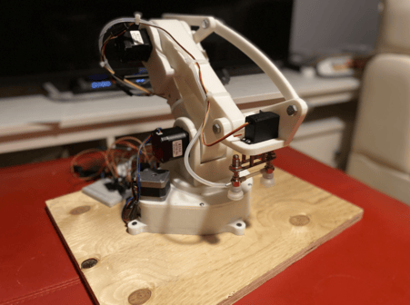
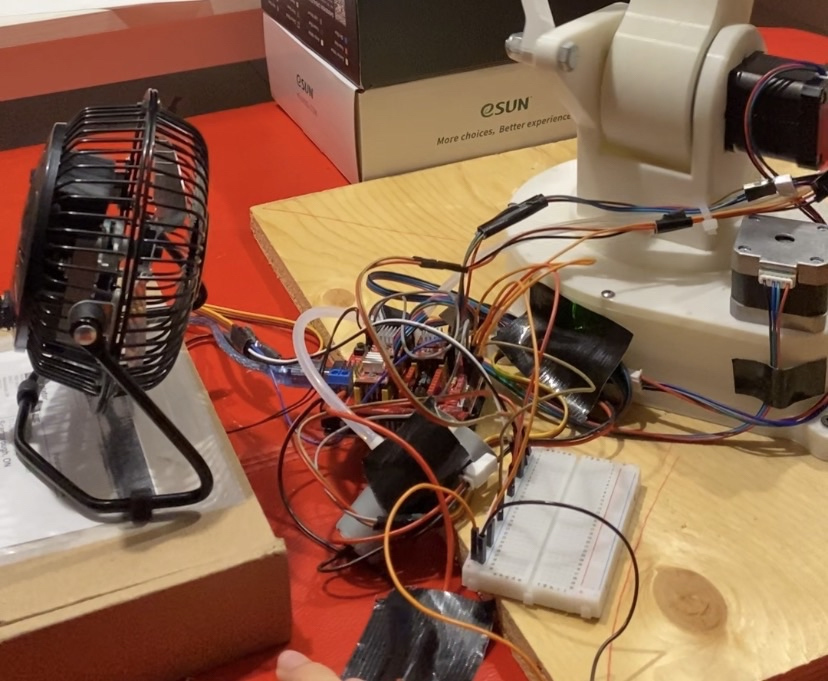

# SolidWorks Controlled Stacking Robot Arm

I built this robot arm in the summer before university started. It’s fully 3D‑printed with my Ender 3. It features custom‑designed cycloidal gearboxes, a bar‑linkage system inspired by industrial palletizing robots, an inverse‑kinematics‑based coordinate motion system built from scratch, and SolidWorks macros that let me directly control the robot inside the CAD software.

*[Click here to skip to Demo Video](#demo-video-youtube)*

## Gearboxes

Designed three cycloidal gearboxes for NEMA 17 motors. All of them are structurally integrated into the frame for a lighter and more dynamic design. The first two, mounted in the top and bottom joints, use a 1:20 ratio and deliver 15 Nm of torque. The last gearbox, mounted at the base, uses a 1:15 ratio, delivers 12 Nm of torque, and features a slightly different eccentrically driven cycloidal mechanism.

  
  

## Bar Linkage End Effector System

Implemented a bar‑linkage system inspired by industrial palletizing robots to keep the end effector perpetually parallel to the floor throughout its motion. This enables the use of a pneumatic vacuum‑suction mechanism for reliable pick‑and‑place operations.

## Wiring Schematics

Wired an Arduino to a CNC shield and a 12V power supply to drive the three stepper motors. The 5V pins on the CNC shield also power the pneumatic pump and the servo motor for the end effector. Additionally, a fan was placed nearby to cool the motor drivers.

## Inverse Kinematics and Linear Propagation Program

Built an inverse kinematics system that converts Cartesian XYZ coordinates into robot joint‑angle instructions, using geometric relationships to determine the required joint positions. Also implemented a linear propagation system that enables the end effector to move in straight or diagonal paths by dynamically adjusting motor angle speeds.

## SolidWorks Macros for Controlling Robot Arm

Created SolidWorks Macros with the SolidWorks API that extract pick‑up and drop‑off coordinates from two SolidWorks assembly files: one showing the robot's starting environment and one showing the final stacked layout. After extraction, a temporary PowerShell script is generated to send the coordinates to the computer port connected to the robot. With the coordinates, the robot starts picking up and placing objects in real time to recreate the final stacked layout.

### Demo Video (Youtube)

## CAD Files

The full CAD model for this project is available on GrabCAD:

[**SolidWorks Controlled Stacking Robot Arm – GrabCAD**](https://grabcad.com/library/solidworks-controlled-stacking-robot-arm-1)
